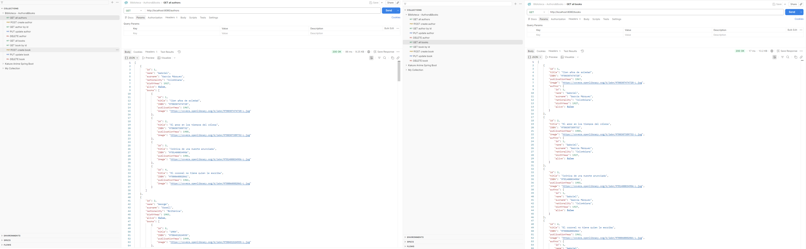
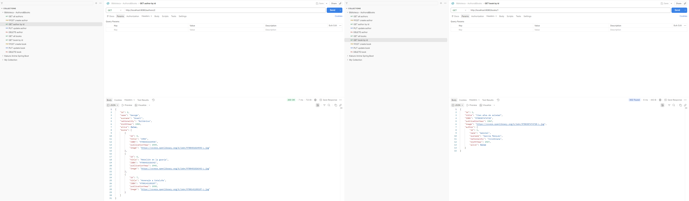
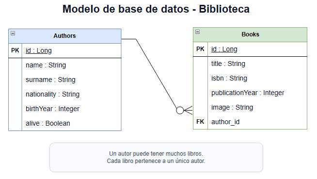

# 📚 Biblioteca Backend
  

[English Version](README.en.md)

## 📝 Descripción
 

Biblioteca Backend es el backend de una aplicación completa de biblioteca formada por un frontend independiente y esta API REST. Este repositorio se encarga de la gestión de autores y libros, organiza la lógica en capas `controller`, `service`, `repository` y `model`, y persiste la información en MySQL mediante Spring Data JPA / Hibernate.

El backend está preparado para ser consumido por un cliente frontend separado, por lo que forma parte de una solución compuesta por frontend y backend. Además de cubrir las operaciones CRUD sobre `authors` y `books`, la documentación facilita la replicación del entorno desde cero con una carga inicial de datos pensada para pruebas en Postman y visualización del modelo en Draw.io / Diagrams.net.

## 🛠️ Tecnologías
   

- Java 25
- Spring Boot
- Maven
- MySQL
- Spring Data JPA / Hibernate
- Postman
- Draw.io / Diagrams.net

## 🧱 Arquitectura del proyecto
 

```text
src/main/java/com/biblioteca/backend
├── controller
│   ├── AuthorController.java
│   └── BookController.java
├── model
│   ├── Author.java
│   └── Book.java
├── repository
│   ├── AuthorRepository.java
│   └── BookRepository.java
├── service
│   ├── AuthorService.java
│   └── BookService.java
└── BibliotecaBackendApplication.java
```

- `controller` expone los endpoints REST para autores y libros.
- `service` centraliza la lógica de negocio.
- `repository` gestiona el acceso a datos con Spring Data JPA.
- `model` define las entidades y la relación entre `Author` y `Book`.
- La estructura del backend está preparada para ser consumida por un frontend independiente dentro de la aplicación completa.

## 🗃️ Modelo de datos
 

- `Author`
  - `id`
  - `name`
  - `surname`
  - `nationality`
  - `birthYear`
  - `alive`
- `Book`
  - `id`
  - `title`
  - `isbn`
  - `publicationYear`
  - `image`
  - `author_id`
- Relación
  - one-to-many entre `Author` y `Book`
  - un autor puede tener muchos libros
  - cada libro pertenece a un único autor

## 🔗 Endpoints
 

| Recurso | Método | Ruta | Descripción |
| --- | --- | --- | --- |
| Authors | `GET` | `/authors` | Obtiene todos los autores |
| Authors | `GET` | `/authors/{id}` | Obtiene un autor por id |
| Authors | `POST` | `/authors` | Crea un autor |
| Authors | `PUT` | `/authors/{id}` | Actualiza un autor existente |
| Authors | `DELETE` | `/authors/{id}` | Elimina un autor |
| Books | `GET` | `/books` | Obtiene todos los libros |
| Books | `GET` | `/books/{id}` | Obtiene un libro por id |
| Books | `POST` | `/books` | Crea un libro |
| Books | `PUT` | `/books/{id}` | Actualiza un libro existente |
| Books | `DELETE` | `/books/{id}` | Elimina un libro |

## 🌐 Frontend relacionado
 

Este backend forma parte de una solución completa de biblioteca y está pensado para ser consumido por un frontend independiente. Si quieres revisar la interfaz cliente que utiliza esta API REST, puedes acceder a su repositorio aquí:

[Biblioteca Frontend](https://github.com/Maria19761976/BibliotecaFronted)

## ⚙️ Configuración y ejecución
  

Para replicar el proyecto desde cero, sigue este orden:

1. Clona el repositorio.

   ```bash
   git clone <repository-url>
   cd Biblioteca-Backend
   ```

2. Crea la base de datos MySQL con este nombre exacto:

   ```sql
   CREATE DATABASE biblioteca_db;
   ```

3. Revisa `src/main/resources/application.properties`, porque el proyecto está configurado así:

   ```properties
   spring.datasource.url=jdbc:mysql://localhost:3306/biblioteca_db?useSSL=false&serverTimezone=UTC
   spring.datasource.username=root
   spring.datasource.password=root

   spring.jpa.hibernate.ddl-auto=update
   spring.jpa.show-sql=true
   spring.jpa.properties.hibernate.format_sql=true
   spring.jpa.database-platform=org.hibernate.dialect.MySQLDialect
   ```

4. Si no usas `root` / `root`, modifica `spring.datasource.username` y `spring.datasource.password` antes de ejecutar el backend.

5. Ejecuta el backend una primera vez para que Hibernate cree automáticamente las tablas:

   ```powershell
   .\mvnw.cmd spring-boot:run
   ```

   ```bash
   ./mvnw spring-boot:run
   ```

6. Solo después del primer arranque, ejecuta las queries SQL en MySQL Workbench.

7. Ejecuta primero las queries de `authors` y después las de `books`, porque `books` depende de `author_id`.

## 🧪 Queries SQL para MySQL Workbench
 

Ejecuta estas queries únicamente después del primer arranque del backend. El orden correcto es: primero `authors` y después `books`.

**AUTHORS**

```sql
USE biblioteca_db;

TRUNCATE TABLE authors;

INSERT INTO authors (name, surname, nationality, birth_year, alive) VALUES
('Gabriel', 'García Márquez', 'Colombiana', 1927, false),
('George', 'Orwell', 'Británica', 1903, false),
('Jane', 'Austen', 'Británica', 1775, false),
('Isabel', 'Allende', 'Chilena', 1942, true),
('Haruki', 'Murakami', 'Japonesa', 1949, true),
('Stephen', 'King', 'Estadounidense', 1947, true),
('J. K.', 'Rowling', 'Británica', 1965, true),
('J. R. R.', 'Tolkien', 'Británica', 1892, false),
('Miguel', 'de Cervantes', 'Española', 1547, false),
('Julio', 'Verne', 'Francesa', 1828, false),
('Agatha', 'Christie', 'Británica', 1890, false),
('Carlos', 'Ruiz Zafón', 'Española', 1964, false),
('Dan', 'Brown', 'Estadounidense', 1964, true),
('Suzanne', 'Collins', 'Estadounidense', 1962, true);

SELECT * FROM authors;
```

**BOOKS**

```sql
USE biblioteca_db;

TRUNCATE TABLE books;

INSERT INTO books (title, isbn, publication_year, image, author_id) VALUES
('Cien años de soledad', '9780307474728', 1967, 'https://covers.openlibrary.org/b/isbn/9780307474728-L.jpg', 1),
('El amor en los tiempos del cólera', '9780307389732', 1985, 'https://covers.openlibrary.org/b/isbn/9780307389732-L.jpg', 1),
('Crónica de una muerte anunciada', '9781400034956', 1981, 'https://covers.openlibrary.org/b/isbn/9781400034956-L.jpg', 1),
('El coronel no tiene quien le escriba', '9780060882861', 1961, 'https://covers.openlibrary.org/b/isbn/9780060882861-L.jpg', 1),

('1984', '9780451524935', 1949, 'https://covers.openlibrary.org/b/isbn/9780451524935-L.jpg', 2),
('Rebelión en la granja', '9780451526342', 1945, 'https://covers.openlibrary.org/b/isbn/9780451526342-L.jpg', 2),
('Homenaje a Cataluña', '9780141185187', 1938, 'https://covers.openlibrary.org/b/isbn/9780141185187-L.jpg', 2),

('Orgullo y prejuicio', '9780141439518', 1813, 'https://covers.openlibrary.org/b/isbn/9780141439518-L.jpg', 3),
('Sentido y sensibilidad', '9780141439662', 1811, 'https://covers.openlibrary.org/b/isbn/9780141439662-L.jpg', 3),
('Emma', '9780141439587', 1815, 'https://covers.openlibrary.org/b/isbn/9780141439587-L.jpg', 3),

('La casa de los espíritus', '9780553383805', 1982, 'https://covers.openlibrary.org/b/isbn/9780553383805-L.jpg', 4),
('Eva Luna', '9780553383829', 1987, 'https://covers.openlibrary.org/b/isbn/9780553383829-L.jpg', 4),
('Paula', '9780060927272', 1994, 'https://covers.openlibrary.org/b/isbn/9780060927272-L.jpg', 4),
('Hija de la fortuna', '9780061120252', 1999, 'https://covers.openlibrary.org/b/isbn/9780061120252-L.jpg', 4),

('Tokio Blues', '9788483835043', 1987, 'https://covers.openlibrary.org/b/isbn/9788483835043-L.jpg', 5),
('Kafka en la orilla', '9788483835234', 2002, 'https://covers.openlibrary.org/b/isbn/9788483835234-L.jpg', 5),
('1Q84', '9780307593313', 2009, 'https://covers.openlibrary.org/b/isbn/9780307593313-L.jpg', 5),
('Al sur de la frontera, al oeste del sol', '9788483835258', 1992, 'https://covers.openlibrary.org/b/isbn/9788483835258-L.jpg', 5),

('It', '9781501142970', 1986, 'https://covers.openlibrary.org/b/isbn/9781501142970-L.jpg', 6),
('El resplandor', '9780307743657', 1977, 'https://covers.openlibrary.org/b/isbn/9780307743657-L.jpg', 6),
('Misery', '9781501143106', 1987, 'https://covers.openlibrary.org/b/isbn/9781501143106-L.jpg', 6),
('Carrie', '9780307743664', 1974, 'https://covers.openlibrary.org/b/isbn/9780307743664-L.jpg', 6),

('Harry Potter y la piedra filosofal', '9788478884452', 1997, 'https://covers.openlibrary.org/b/isbn/9788478884452-L.jpg', 7),
('Harry Potter y la cámara secreta', '9788478884957', 1998, 'https://covers.openlibrary.org/b/isbn/9788478884957-L.jpg', 7),
('Harry Potter y el prisionero de Azkaban', '9788478885190', 1999, 'https://covers.openlibrary.org/b/isbn/9788478885190-L.jpg', 7),
('Harry Potter y el cáliz de fuego', '9788478886456', 2000, 'https://covers.openlibrary.org/b/isbn/9788478886456-L.jpg', 7),

('El Hobbit', '9788445073802', 1937, 'https://covers.openlibrary.org/b/isbn/9788445073802-L.jpg', 8),
('La comunidad del anillo', '9788445073895', 1954, 'https://covers.openlibrary.org/b/isbn/9788445073895-L.jpg', 8),
('Las dos torres', '9788445073901', 1954, 'https://covers.openlibrary.org/b/isbn/9788445073901-L.jpg', 8),
('El retorno del rey', '9788445073918', 1955, 'https://covers.openlibrary.org/b/isbn/9788445073918-L.jpg', 8),

('Don Quijote de la Mancha', '9788420412146', 1605, 'https://covers.openlibrary.org/b/isbn/9788420412146-L.jpg', 9),
('Novelas ejemplares', '9788420412153', 1613, 'https://covers.openlibrary.org/b/isbn/9788420412153-L.jpg', 9),
('La Galatea', '9788420412160', 1585, 'https://covers.openlibrary.org/b/isbn/9788420412160-L.jpg', 9),

('Viaje al centro de la Tierra', '9788420674209', 1864, 'https://covers.openlibrary.org/b/isbn/9788420674209-L.jpg', 10),
('Veinte mil leguas de viaje submarino', '9788420674216', 1870, 'https://covers.openlibrary.org/b/isbn/9788420674216-L.jpg', 10),
('La vuelta al mundo en ochenta días', '9788420674223', 1873, 'https://covers.openlibrary.org/b/isbn/9788420674223-L.jpg', 10),
('De la Tierra a la Luna', '9788420674230', 1865, 'https://covers.openlibrary.org/b/isbn/9788420674230-L.jpg', 10),

('Asesinato en el Orient Express', '9780007119318', 1934, 'https://covers.openlibrary.org/b/isbn/9780007119318-L.jpg', 11),
('Diez negritos', '9788497593793', 1939, 'https://covers.openlibrary.org/b/isbn/9788497593793-L.jpg', 11),
('Muerte en el Nilo', '9788497594257', 1937, 'https://covers.openlibrary.org/b/isbn/9788497594257-L.jpg', 11),
('El asesinato de Roger Ackroyd', '9788427298613', 1926, 'https://covers.openlibrary.org/b/isbn/9788427298613-L.jpg', 11),

('La sombra del viento', '9788408172178', 2001, 'https://covers.openlibrary.org/b/isbn/9788408172178-L.jpg', 12),
('El juego del ángel', '9788408081180', 2008, 'https://covers.openlibrary.org/b/isbn/9788408081180-L.jpg', 12),
('El prisionero del cielo', '9788408101444', 2011, 'https://covers.openlibrary.org/b/isbn/9788408101444-L.jpg', 12),

('El código Da Vinci', '9780307474278', 2003, 'https://covers.openlibrary.org/b/isbn/9780307474278-L.jpg', 13),
('Ángeles y demonios', '9781416524793', 2000, 'https://covers.openlibrary.org/b/isbn/9781416524793-L.jpg', 13),
('Inferno', '9780385537858', 2013, 'https://covers.openlibrary.org/b/isbn/9780385537858-L.jpg', 13),

('Los juegos del hambre', '9788427202122', 2008, 'https://covers.openlibrary.org/b/isbn/9788427202122-L.jpg', 14),
('En llamas', '9788427202146', 2009, 'https://covers.openlibrary.org/b/isbn/9788427202146-L.jpg', 14),
('Sinsajo', '9788427203181', 2010, 'https://covers.openlibrary.org/b/isbn/9788427203181-L.jpg', 14);

SELECT * FROM books;
```

## 📸 Capturas del proyecto
 

**Postman - comprobación de `GET /authors` y `GET /books`**



**Postman - comprobación de `GET /authors/{id}` y `GET /books/{id}`**



**Modelo de base de datos en Draw.io / Diagrams.net**



## 👥 Equipo
 

- David Navarro
- Facundo Garavagalia
- Javier Galvañ
- María Pérez
- Suso Suárez

## 🚦 Estado del proyecto
 

El proyecto cuenta con una base funcional para gestionar autores y libros mediante operaciones CRUD, persistencia en MySQL y validación de endpoints con Postman. Como parte de una aplicación completa de biblioteca, este backend está listo para ser consumido por el frontend separado y la documentación incluida permite clonar el repositorio, configurar la base de datos y cargar los datos iniciales siguiendo un flujo claro.
